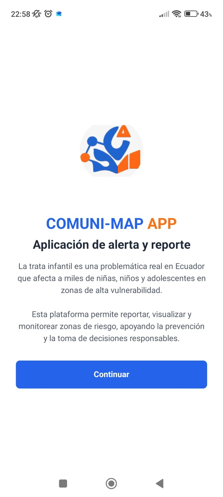
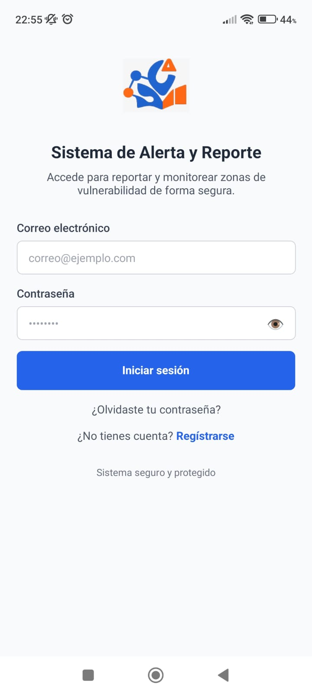
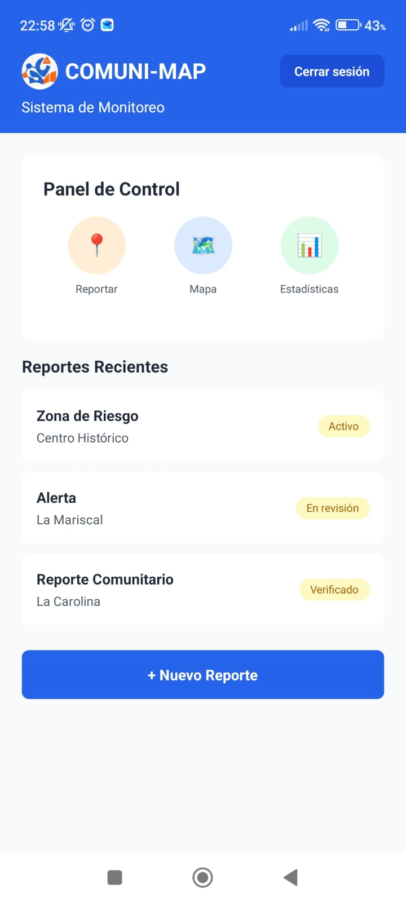

# COMUNI-MAP APP


## Descripción del Proyecto

COMUNI-MAP es una aplicación móvil desarrollada en React Native que permite reportar, visualizar y monitorear zonas de riesgo relacionadas con la trata infantil en Ecuador. La plataforma busca apoyar la prevención y la toma de decisiones responsables en zonas de alta vulnerabilidad.

## Características Principales

- Sistema de autenticación con validación de campos (Frontend)
- Pagina principal
- Login
- Home


## Tecnologías Utilizadas

**Framework y Lenguajes:**
- React Native
- TypeScript
- Expo

**Librerías Principales:**
- `react` (18.3.1)
- `react-native` (0.76.5)
- `expo` (~52.0.0)
- `nativewind` (^4.0.1) - Tailwind CSS para React Native
- `react-native-safe-area-context` (4.12.0)
- `tailwindcss` (^3.3.2)

## Estructura del Proyecto

```
my-expo-app/
├── assets/
│   └── onlylogo.png
├── components/
│   ├── Logo.tsx
│   ├── Button.tsx
│   ├── InputField.tsx
│   ├── WelcomeScreen.tsx
│   ├── LoginScreen.tsx
│   └── HomeScreen.tsx
├── App.tsx
├── babel.config.js
├── tailwind.config.js
├── global.css
└── package.json
```

## Instalación

1. Clonar el repositorio
```bash
git clone <url-del-repositorio>
cd my-expo-app
```

2. Instalar dependencias
```bash
npm install
```

3. Iniciar el proyecto
```bash
npx expo start
```

4. Ejecutar en dispositivo
- Escanear código QR con Expo Go
- Presionar `a` para Android emulator
- Presionar `i` para iOS simulator

## Capturas de Pantalla

### Pantalla de Bienvenida


Pantalla inicial con información sobre la aplicación y el logo de COMUNI-MAP.

### Pantalla de Login


Sistema de autenticación con validación de campos de email y contraseña.

### Pantalla Principal



Panel de control con reportes recientes y accesos rápidos a funcionalidades.

## Componentes Principales

**WelcomeScreen:** Pantalla de bienvenida que presenta la aplicación y su propósito.

**LoginScreen:** Permite el inicio de sesión con validación de campos y opción de recuperar contraseña.

**HomeScreen:** Pantalla principal con panel de control, lista de reportes y opciones de navegación.

**Button:** Componente reutilizable de botones con variantes primary y secondary.

**InputField:** Campo de entrada personalizado con labels y opción para mostrar/ocultar contraseña.

**Logo:** Componente del logo con diseño circular.

## Configuración de NativeWind

Archivo `babel.config.js`:
```javascript
module.exports = function(api) {
  api.cache(true);
  return {
    presets: ['babel-preset-expo'],
    plugins: ['nativewind/babel'],
  };
};
```

Archivo `tailwind.config.js`:
```javascript
module.exports = {
  content: [
    "./App.{js,jsx,ts,tsx}",
    "./components/**/*.{js,jsx,ts,tsx}"
  ],
  presets: [require("nativewind/preset")],
  theme: {
    extend: {},
  },
  plugins: [],
}
```

## Solución de Problemas

**Error de Babel:** Verificar configuración en `babel.config.js` y reiniciar con `npx expo start -c`

**Estilos no se aplican:** Limpiar caché con `npx expo start -c` y verificar que `global.css` esté importado.

**Imágenes no cargan:** Verificar rutas y que las imágenes estén en la carpeta `assets/`.

## Próximas Mejoras

- Implementar registro de usuarios
- Integrar mapa interactivo con geolocalización
- Conectar con backend para persistencia de datos
- Agregar notificaciones push
- Sistema de estadísticas con gráficos
- Modo oscuro

## Autor

Gabriel Ruales
Proyecto de Programación para dispositivos moviles.
Enero 2026

Nota: Este proyecto busca crear conciencia sobre la problemática de la trata infantil en Ecuador y desarrollar herramientas tecnológicas para su prevención.